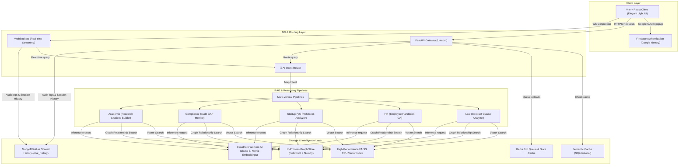

# DocsAI — Multi-Vertical Agentic RAG Platform

DocsAI is an enterprise-grade AI Document Q&A and Knowledge Graph Platform designed to analyze, index, search, and reason over unstructured documents across multiple business verticals. 

Built with a modern FastAPI backend, a custom high-performance in-process Graph Database, Cloudflare Workers AI model routing, and a polished React/Vite light-mode frontend, the system provides context-aware multi-step reasoning, semantic citations, and historical query auditing.

---

## 🏗️ System Architecture



---

## 🌟 Core Backend & System Features

### 1. 🧠 Multi-Vertical Intent Routing
DocsAI supports multiple business domains natively, each configured with specific prompting agents, chunking rules, and retrieval strategy parameters:
*   **Academic Research:** Designed to read papers, track author names, build citation references, and map paper topics.
*   **Legal Contracts:** Analyzes agreements, identifies obligations, classifies liability clauses, and scans for red flags.
*   **Startup & VC:** Evaluates VC pitch decks, maps startup investment trends, and matches contributors.
*   **Compliance Audits:** Monitors regulation changes, performs compliance gap analysis, and traces regulatory obligations.
*   **HR Policies:** Accesses employee handbooks, reviews policies, and answers HR questions with cited rules.
*   *An intelligent **AI Intent Router** automatically classifies user queries and routes them to the correct vertical pipeline dynamically.*

---

### 2. 📸 Multimodal RAG Ingestion Pipeline
DocsAI handles image-heavy, scanned, and digital documents through a robust, asynchronous **5-Tier Multimodal Ingestion Pipeline**:
*   **Tier 1: Native Text Extraction:** Inspects and parses digital PDF layers directly to extract clean Unicode text structures.
*   **Tier 2: PyTesseract OCR:** Triggers local optical character recognition if a page is determined to be scanned or blank.
*   **Tier 3: AWS Textract:** Secondary commercial cloud engine fallback for tables and complex tabular layouts.
*   **Tier 4: OCR.space API:** Tertiary high-accuracy backup API to parse document sections.
*   **Tier 5: Cloudflare Workers AI Vision OCR:** Employs vision-language transformers to process visual pages and describe embedded charts, figures, and diagrams as first-class text features (`[VISUAL DESCRIPTION: ...]`). Includes a *hallucination guard* that calculates repetition ratios to auto-reject looping model outputs.

---

### 3. ⚡ In-Process Graph Database
Replaces resource-heavy external graph infrastructure with a thread-safe, memory-efficient **hybrid Vector-Graph Store**:
*   **NetworkX Topology:** Stores parent-child relationships between documents and chunks, entity extraction linkages (obligations, authors, clauses), and keyword cross-references.
*   **FAISS Vector Acceleration:** Embeds text chunks via `nomic-embed-text` and structures high-speed nearest-neighbor retrieval indexes.
*   **Re-Entrant RWLock Safety:** Regulates multi-threaded performance with a Reader-Writer lock. Supports unlimited parallel reads during search queries and safely serializes background disk write-backs to `graph_store.json` during file ingestion.

---

### 4. 🤖 Multi-Step ReAct Agent Orchestrator
For cross-document, comparative, or analytical inquiries, DocsAI triggers a fully autonomous planning and execution cycle:
*   **AgentPlanner:** Uses LLM reasoning to decompose user prompts into a structured list of dependent tools steps.
*   **AgentExecutor:** Resolves variable dependencies sequentially, calls appropriate pipeline actions (like `search_documents`, `metadata_aggregation`, or `redflags_audit`), and records execution traces.
*   **Synthesis Engine:** Combines intermediate tool responses and yields a unified comparative response complete with dynamic citations.

---

### 5. 🛡️ Input & Security Guardrails
Maintains robust safety margins at the API level before dispatching queries to RAG pipelines or LLMs:
*   **Jailbreak Prevention:** Scans inputs with pattern regexes to block prompts attempting to override rules, reveal instructions, or bypass default settings (e.g. `ignore previous instructions`, `reveal system prompt`).
*   **Content Sanitization:** Automatically flags and blocks requests containing toxic keywords, malicious code execution requests, or authentication bypass instructions.

---

### 6. 🔐 Firebase Google Identity Authentication
*   **Google OAuth Single Sign-On:** Integrates with the Firebase Web SDK to trigger a secure browser account chooser.
*   **Developer Mode Fallback:** Automatically falls back to a simulated Dev User session if Firebase API keys are unconfigured, allowing offline local testing.

---

### 🗂️ Ingestion Vault & Background Jobs
*   Upload documents to the **Document Vault**.
*   Two-phase classification agent automatically scans text previews and auto-detects the document vertical (Law, HR, Startup, etc.).
*   Documents are processed in the background using an asynchronous `asyncio` job queue.

---

### 🔍 Auditing Logs & MongoDB History
*   Keeps session conversation logs and query execution parameters synced with MongoDB Atlas (stored in the constraint-free `chat_history` collection).
*   Tracks average retrieval latency, query response confidence scores, and unanswerable question analytics in the **History** and **Analytics** dashboards.

---

### 🎨 Premium Light UI Theme
*   Stunning glassmorphism design system using HSL variables.
*   Subtle background grid mesh and micro-animations.
*   Interactive **Knowledge Graph Visualizer** viewport rendered on an engineering-grade dark coordinate grid with radial glows.

---

## 🛠️ Environment Setup

Create a `.env` file in the root directory by copying the template:

```powershell
Copy-Item .env.example .env
```

Define the configuration parameters:

```env
# Cloudflare Workers AI Credentials
CF_ACCOUNT_ID=your_cloudflare_account_id
CF_API_TOKEN=your_cloudflare_api_token
NOMIC_API_KEY=your_nomic_embedding_api_key

# Database Connections
MONGODB_URI=your_mongodb_atlas_connection_string
MONGODB_DB=job_agent
MONGODB_COLLECTION=chat_history

# Firebase Configuration (Sign-In with Google)
VITE_FIREBASE_API_KEY=your-firebase-api-key
VITE_FIREBASE_AUTH_DOMAIN=your-auth-domain.firebaseapp.com
VITE_FIREBASE_PROJECT_ID=your-project-id
VITE_FIREBASE_STORAGE_BUCKET=your-project-id.appspot.com
VITE_FIREBASE_MESSAGING_SENDER_ID=your-sender-id
VITE_FIREBASE_APP_ID=your-app-id

# Local Configuration
VITE_API_BASE_URL=http://localhost:8000/api/v1
VITE_WS_BASE_URL=ws://localhost:8000/api/v1
VITE_TENANT_ID=tenant-123
```

---

## 🚀 Running Locally

### Backend Server
Install Python dependencies and run the FastAPI server (uvicorn watches only `/app` to prevent file-lock reloading cycles):

```powershell
cd backend
python -m venv .venv
.\.venv\Scripts\Activate.ps1
pip install -r requirements.txt
python -m spacy download en_core_web_sm
python -m uvicorn main:app --host 127.0.0.1 --port 8000 --reload --reload-dir app
```

### Frontend Web Client
Run Vite dev server locally:

```powershell
cd frontend
npm install
npm run dev
```

*Access the application at `http://localhost:5173/`.*
