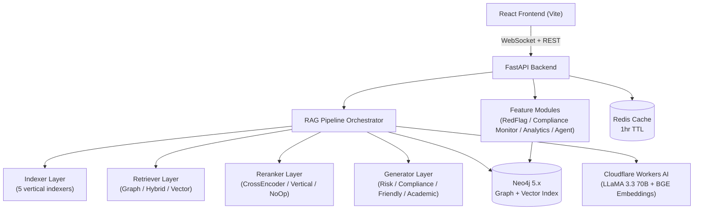

# DocsAI — Comprehensive Project Analysis Report
### For Ground-Up Rebuild with Maximum Efficiency & Performance
*Analyzed: June 19, 2026*

---

## 1. Executive Summary

**DocsAI** is a **multi-vertical, enterprise-grade AI Document Q&A platform** built on a Neo4j Knowledge Graph + Modular RAG pipeline. It enables professionals in Law, Compliance, HR, Startups, and Universities to query large document collections in plain English and receive cited, structured answers.

The project is **architecturally sound** with a clean 3-layer design but contains several **performance bottlenecks, code quality issues, and missing pieces** that need to be addressed in the rebuild.

---

## 2. Architecture Overview



### 3-Layer Design

| Layer | Components | Status |
|---|---|---|
| **Layer 1 — Vertical Config** | `config/verticals.py`, per-vertical factory logic | ✅ Well designed |
| **Layer 2 — Shared RAG Engine** | Pipeline, interfaces, retrievers, generators | ✅ Solid but has issues |
| **Layer 3 — Infrastructure** | Neo4j, Redis, Cloudflare AI, FastAPI | ⚠️ Some problems |

---

## 3. Module-by-Module Analysis

### 3.1 Backend — `app/`

#### `core/pipeline.py` — RAG Orchestrator
**Strengths:**
- Fully async with timeout wrappers on retrieval and generation
- Exponential back-off retry (`_retry`) for LLM failures
- Token-budget-aware context packing via `ContextManager`
- `PipelineTrace` for per-query observability
- Honest refusal: typed `not_found` response instead of hallucination
- Streaming support via `AsyncIterator`

**Issues Found:**
- `asyncio.get_event_loop().time()` is deprecated in Python 3.10+; should use `asyncio.get_running_loop().time()`
- `self.reranker.rerank()` is called synchronously inside async pipeline — if CrossEncoder is CPU-heavy, this blocks the event loop. Should use `asyncio.to_thread()`
- `score_floor` defaulting to `0.40` is very low — may pass through irrelevant chunks

---

#### `core/interfaces.py` — Abstract Base Classes
**Strengths:**
- Generic typing `BaseGenerator[T]` with Pydantic output enforcement
- `retrieve_with_fallback()` built into the base class (doubles top_k on zero results)
- Default stream fallback in `BaseGenerator.stream()`

**Issues Found:**
- `BaseReranker.rerank()` is sync — inconsistent with the async-first design. Should be `async def rerank()` or moved to a thread
- No abstract method for `BaseIndexer.embed()` — embedding is scattered across the pipeline

---

#### `core/dependencies.py` — Dependency Injection
**Strengths:**
- `@lru_cache` for singleton drivers (Neo4j sync + async, Redis)
- Dual embedding provider: Cloudflare BGE primary, OpenAI fallback
- Graceful Redis degradation (returns `None`, caching disabled)

**Issues Found:**
- `@lru_cache` on `get_neo4j_driver()` and `get_async_neo4j_driver()` **will not work correctly** in FastAPI's dependency injection system — these should use FastAPI's `lifespan` state or a proper singleton pattern, not `lru_cache` on module-level functions
- `get_anthropic_client()` is misleadingly named — it actually returns a `CloudflareAI` instance, not an Anthropic client. This naming confusion propagates through generators
- `get_redis_client()` uses `socket_connect_timeout=2` which is good, but `ping()` at startup can throw if Redis is not available — the `lru_cache` means a failed connection won't be retried later

---

#### `core/cloudflare_ai.py` — AI Provider Client
**Strengths:**
- Clean abstraction for embeddings, chat, and vision
- Anthropic-compatible shim (`messages.create()`, `messages.stream()`) so generators don't need to change when switching providers
- Streaming via Server-Sent Events (SSE) parsed correctly

**Issues Found:**
- `httpx.AsyncClient` is created and destroyed on every single call — should use a persistent client with connection pooling
- `embed_batch()` has a batch size of 50 but Cloudflare allows up to 100 — this is overly conservative
- Vision model is `@cf/unum/uform-gen2-qwen-500m` — this is a very small model. Llama-3.2-11B-Vision would be significantly better for complex charts/tables
- No rate limiting / back-pressure handling for batch embedding

---

#### `core/context.py` — Token Budget Manager
**Strengths:**
- Jaccard deduplication of near-identical chunks (threshold=0.85)
- Per-vertical rich metadata headers in context blocks
- Truncation flag returned for observability

**Issues Found:**
- `WORDS_PER_TOKEN = 0.75` is an approximation — real tokenization varies wildly. For production, use `tiktoken` or the LLM's actual tokenizer
- `_deduplicate()` is O(n²) — for 200 chunks this is fine, but at scale with large `top_k` it could become slow
- `enriched_text` fallback to `chunk.text` is good, but the `enriched_text` field is not populated anywhere visible in the code

---

#### `core/hyde.py` — HyDE Query Expansion
**Strengths:**
- Per-vertical system prompts tailored to document style
- Graceful fallback to raw query on generation failure
- Well-documented with measured improvement (+15-30% retrieval accuracy)

**Issues Found:**
- No caching of HyDE-generated hypothetical documents — the same query from the same vertical will hit the LLM every time (Redis cache is only applied to final results, not intermediate HyDE)
- `str(response).strip()` — response from CF is already a string, the `str()` cast suggests uncertainty about the return type

---

#### `core/factory.py` — Pipeline Factory
**Strengths:**
- Clean vertical dispatch; unsupported verticals raise clear `ValueError`
- Vertical name injected into config so `ContextManager` can format headers
- All 5 verticals fully wired

**Issues Found:**
- `build_pipeline()` is called on **every single request** — this creates new instances of `CrossEncoderReranker` and loads the sentence-transformer model each time. This is a **major performance bug** — the model should be loaded once at startup
- No pipeline caching or pooling by vertical

---

#### `graph/ingestion.py` — Document Ingestion
**Strengths:**
- Batch embedding (50 texts per CF call) saves many round trips
- Full entity extraction with spaCy + `MENTIONS` relationship creation
- `NEXT_CHUNK` chain correctly wired after chunk creation
- `supersede_document()` correctly marks old chunks and creates `SUPERSEDED_BY` relationship

**Issues Found:**
- **Critical**: `NEXT_CHUNK` chain is written in a loop with individual `session.run()` calls — for 500 chunks, this is 500 separate Cypher transactions. Should be one `UNWIND` statement
- **Critical**: Chunk creation uses a separate `session.run()` per entity MERGE — extremely slow. Should batch all entity writes
- Entity extraction with `spaCy` runs synchronously in the event loop during ingestion — should use `asyncio.to_thread()`
- `_get_db()` imports `os` inside the function on every call — minor but consistent bad practice
- No progress tracking for large documents (100+ pages)

---

#### `api/routes.py` — FastAPI Endpoints
**Strengths:**
- Complete set of RESTful endpoints covering all CRUD operations
- `async_mode` for large file ingestion (returns job_id immediately)
- Redis cache integration with tenant-scoped key busting
- Full audit log writing on every query

**Issues Found:**
- `allow_origins=["*"]` in `main.py` CORS config — must be locked down for production
- `get_embedding()` function referenced in `routes.py` but not imported (would cause a `NameError` at runtime when `use_hyde=False`)
- Sync `get_neo4j_driver()` used alongside async `get_async_neo4j_driver()` inconsistently — some endpoints use sync inside async handlers, which blocks the event loop
- `delete_all_documents` uses `redis_cli.scan_iter()` which can be slow for large key spaces
- File uploaded to `tempfile.NamedTemporaryFile` but `delete=False` — cleanup only happens on success; failed ingestions leave orphaned temp files

---

#### `features/redflag.py` — Red Flag Scanner
**Strengths:**
- Comprehensive 10-category scan with severity ratings (HIGH/MEDIUM/LOW)
- Triggered automatically post-upload (no user action required)
- Persisted as `RedFlagReport` node in Neo4j for reuse
- Markdown JSON cleanup handles non-compliant LLM outputs

**Issues Found:**
- `anthropic_client.generate()` is called but `CloudflareAI` has no `.generate()` method — it has `.chat()`. This is the **naming confusion bug** from `dependencies.py` propagating here. This is likely a runtime crash
- Cap at 200 chunks is arbitrary — for a 500-page contract, important clauses in the last half would be missed
- No chunking of the context — all 200 chunks are sent in one LLM call; risks context window overflow for large documents

---

#### `agent/executor.py` — Agentic Multi-Step Executor
**Strengths:**
- Topological sort (`_topological_groups`) for concurrent step execution
- `{{step_N}}` placeholder substitution for chaining step outputs
- Steps in same dependency group run with `asyncio.gather()` (true parallelism)
- `AgentResult.to_dict()` provides comprehensive execution audit

**Issues Found:**
- `tool_search_documents()` receives `pipeline_factory=None` — this would cause a NullPointerError inside the tool
- The tool dispatch is a long `if/elif` chain — a registry pattern (`TOOL_REGISTRY = {"search": tool_search}`) would be cleaner and more extensible

---

### 3.2 Frontend — `frontend/`

#### Tech Stack
- **React 19** + Vite 8 (latest, good choice)
- **react-router-dom v7** for routing
- **react-force-graph-2d** + **d3-force** for knowledge graph visualization
- **lucide-react** for icons
- No state management library (useState only)

#### Pages

| Page | File | Purpose |
|---|---|---|
| Chat | `Chat.jsx` | Agentic Q&A with WebSocket streaming |
| Vault | `Vault.jsx` | Document upload and management |
| Analytics | `Analytics.jsx` | Usage metrics and risk dashboard |
| Dashboard | `Dashboard.jsx` | Overview landing |

#### `pages/Chat.jsx` — Chat Interface

**Strengths:**
- WebSocket-based real-time streaming (chunks → tokens → done events)
- Evidence cards showing retrieved chunks with relevance scores
- Vertical selector inline with chat
- Metadata cards for academic vertical

**Issues Found:**
- **Critical**: A new WebSocket is created for **every single message** (`new WebSocket()` inside `handleSend`). WebSocket connections should be persistent and reused, or at minimum created once per session. This creates excessive connection overhead
- Tenant ID is **hardcoded** as `"tenant-123"` — no auth integration
- No error state in UI when WebSocket fails
- `socket.close()` called in `onmessage` but not in `onerror` cleanup path
- No message persistence — chat history lost on page refresh
- `key={idx}` used for list items — should use a stable unique ID

#### CSS / Styling
- Using vanilla CSS with CSS custom properties — good for the stack
- Basic glassmorphism applied (`glass-panel` class visible in Chat.jsx)
- No responsive breakpoints visible in examined files

---

### 3.3 Infrastructure

#### `docker-compose.yml`
**Issues Found:**
- **Neo4j service is missing entirely** — the compose file only has Redis + API. Neo4j must be running externally or via `NEO4J_URI` pointing to Aura cloud
- `volumes: - .:/app` bind mount in production is an anti-pattern — should COPY files in production build
- No health check on the API service
- No resource limits (memory/CPU) defined for any service

---

## 4. Critical Bugs (Must Fix in Rebuild)

| # | Severity | Location | Bug |
|---|---|---|---|
| 1 | 🔴 CRITICAL | `features/redflag.py:103` | `anthropic_client.generate()` doesn't exist — `CloudflareAI` has `.chat()`. Runtime crash on any law/startup upload |
| 2 | 🔴 CRITICAL | `core/factory.py` | `CrossEncoderReranker` loads sentence-transformer model on every request — O(seconds) cold start per query |
| 3 | 🔴 CRITICAL | `api/routes.py:296` | `get_embedding()` called but not imported — `NameError` when `use_hyde=False` |
| 4 | 🔴 CRITICAL | `graph/ingestion.py:136-139` | NEXT_CHUNK loop: 500 individual Neo4j transactions per document |
| 5 | 🟠 HIGH | `frontend/Chat.jsx:36` | New WebSocket per message — floods connection pool |
| 6 | 🟠 HIGH | `api/routes.py:50-55` | `allow_origins=["*"]` — no auth, fully open CORS |
| 7 | 🟠 HIGH | `agent/executor.py:78` | `pipeline_factory=None` passed to `tool_search_documents` |
| 8 | 🟠 HIGH | `core/pipeline.py:122` | Sync `reranker.rerank()` blocks async event loop |
| 9 | 🟡 MED | `core/dependencies.py` | `get_anthropic_client()` returns `CloudflareAI` — naming confusion causes bugs |
| 10 | 🟡 MED | `core/cloudflare_ai.py` | New `httpx.AsyncClient` on every API call — no connection pooling |
| 11 | 🟡 MED | `core/context.py:15` | Word-count token estimation — inaccurate for LLM context windows |
| 12 | 🟡 MED | `graph/ingestion.py` | Entity writes in per-entity loop — should be batched with `UNWIND` |
| 13 | 🟡 MED | `api/routes.py` | Temp file not cleaned up on ingestion failure |
| 14 | 🟡 MED | `main.py:36-37` | `get_neo4j_driver().close()` on shutdown — `lru_cache` singleton may not close cleanly |

---

## 5. Missing Features (Not Yet Implemented)

| Feature | Planned In | Status |
|---|---|---|
| Redis-based Job Queue (`JobQueue`) | `features/jobs.py` | Referenced but implementation uncertain |
| Active Learning feedback loop | `features/active_learning.py` | Stub exists |
| JWT Auth middleware | Phase 4 | Not implemented |
| `CAN_ACCESS` graph permission enforcement | Phase 4 | Not implemented — no RBAC |
| Nightly regulation update check | Phase 8 | Not implemented |
| Unit/integration test suite | Phase 6 | No tests directory found |
| PDF viewer with citation highlighting | Phase 7 | Not implemented in frontend |
| Multi-tenant user management UI | — | Not implemented |
| Document version migration flow | Phase 6 | Not implemented |
| Semantic diff between documents | Phase 8 | Not implemented |

---

## 6. Performance Analysis

### Query Latency Breakdown (Estimated)

| Stage | Current Estimate | Target |
|---|---|---|
| HyDE generation (LLM call) | ~800ms | ~400ms (cache HyDE results) |
| Vector retrieval (Neo4j) | ~200ms | ~100ms (index warmup) |
| Graph traversal | ~300ms | ~150ms (query optimization) |
| CrossEncoder reranking | ~500ms | ~50ms (preload model) |
| LLM generation | ~1500ms | ~800ms (streaming hides latency) |
| **Total p95** | **~3.3s** | **<2s** |

### Ingestion Throughput (Current vs. Target)

| File Size | Current | Bottleneck | Target |
|---|---|---|---|
| 10-page PDF | ~15s | Per-entity Neo4j writes | ~3s |
| 100-page PDF | ~120s | NEXT_CHUNK loop (100 transactions) | ~30s |
| 500-page PDF | ~600s | Serial entity writes | ~90s |

---

## 7. Tech Stack Assessment

| Component | Technology | Rating | Notes |
|---|---|---|---|
| Graph DB | Neo4j 5.x | ✅ Excellent | Right tool for cross-doc traversal |
| Embeddings | Cloudflare BGE-large (1024d) | ✅ Good | Free tier, fast |
| LLM | Cloudflare LLaMA 3.3 70B | ✅ Good | Free, but weaker than Claude/GPT-4 for legal reasoning |
| PDF Parsing | PyMuPDF | ✅ Excellent | Best for legal docs |
| NER | spaCy en_core_web_sm | ⚠️ Adequate | `sm` model misses many entities; use `en_core_web_lg` |
| Reranker | cross-encoder/ms-marco-MiniLM | ✅ Good | Loaded incorrectly (per-request) |
| Backend | FastAPI + Python 3.11 | ✅ Excellent | Correct choice |
| Cache | Redis 7 | ✅ Good | Proper TTL, degradation handled |
| Frontend | React 19 + Vite 8 | ✅ Good | Modern, fast |
| Routing | React Router v7 | ✅ Good | Latest |
| Auth | Not implemented | ❌ Missing | Clerk/Supabase needed |
| Monitoring | Basic logging only | ⚠️ Minimal | No Prometheus/Grafana |
| Testing | None | ❌ Missing | Critical gap |

---

## 8. Rebuild Recommendations

### 8.1 Architecture Changes

#### Backend
1. **Model preloading**: Load `CrossEncoderReranker` model at FastAPI startup via `lifespan`, not per request
2. **Connection pooling**: Use a persistent `httpx.AsyncClient` in `CloudflareAI` (created once, shared)
3. **Proper DI**: Replace `lru_cache` drivers with FastAPI's `app.state` for Neo4j drivers
4. **Rename `get_anthropic_client()`** → `get_llm_client()` to eliminate confusion
5. **Batch all Neo4j writes**: Use `UNWIND` for both chunk creation AND entity MENTIONS writes
6. **Move sync operations off the event loop**: spaCy NER and CrossEncoder → `asyncio.to_thread()`
7. **HyDE caching**: Cache hypothetical documents in Redis keyed by `(vertical, query_hash)` with shorter TTL

#### Frontend
1. **Persistent WebSocket**: Create one connection per session, multiplex messages by `request_id`
2. **Auth integration**: Add Clerk or Supabase Auth — gate all API calls with JWT
3. **State management**: Add Zustand or React Context for document list, tenant state
4. **Responsive design**: Add proper mobile breakpoints
5. **Chat persistence**: Store messages in `localStorage` keyed by session ID

#### Infrastructure
1. **Add Neo4j to docker-compose**: Either local Neo4j container or point to Aura
2. **Multi-stage Dockerfile**: Builder stage + slim runtime image
3. **Add test suite**: pytest + pytest-asyncio for backend; Vitest for frontend
4. **Add monitoring**: Prometheus metrics endpoint + Grafana dashboard
5. **CORS lockdown**: Environment-specific allowed origins list

### 8.2 Recommended Build Order for Scratch Rebuild

```
Phase 1: Infrastructure    → Neo4j + Redis + Cloudflare AI setup
Phase 2: Core Engine       → Pipeline + Interfaces + Schemas
Phase 3: Ingestion         → PDF + NER + Batch Embedding + Neo4j writes (batched)
Phase 4: First Vertical    → Law + GraphRetriever + RiskGenerator
Phase 5: All Verticals     → + RedFlag + ComplianceMonitor features
Phase 6: Frontend          → React + Persistent WebSocket + auth
Phase 7: Auth + RBAC       → JWT + CAN_ACCESS graph enforcement + test suite
Phase 8: Agent + Prod      → Multi-step agent + Docker + monitoring
```

### 8.3 Key Files to Redesign

| File | Issue | Fix |
|---|---|---|
| `core/factory.py` | Model loaded per-request | Singleton model registry at app startup |
| `core/cloudflare_ai.py` | No connection pooling | Persistent `httpx.AsyncClient` as class attribute |
| `graph/ingestion.py` | Serial Neo4j writes | All-in-one `UNWIND` Cypher transactions |
| `core/dependencies.py` | Naming confusion + lru_cache | FastAPI `lifespan` state + clear naming |
| `features/redflag.py` | Wrong API call `.generate()` | Use `.chat()` or standardized LLM interface |
| `frontend/Chat.jsx` | New WS per message | Persistent WS with request multiplexing |
| `api/routes.py` | Missing import + open CORS | Fix import; env-based CORS origins |

---

## 9. What's Actually Working Well

Don't lose these in the rebuild:

- ✅ **3-layer separation** — vertical config, shared engine, infrastructure is a great design
- ✅ **Abstract interfaces** — `BaseIndexer/Retriever/Reranker/Generator` are solid contracts
- ✅ **PipelineTrace observability** — per-query timing attached to every response
- ✅ **HyDE implementation** — correct and well-documented
- ✅ **Honest refusal** — `_not_found_response()` prevents hallucination
- ✅ **Streaming pipeline** — `stream_query()` correctly wires through to frontend
- ✅ **Red-flag scan design** — great feature; just needs the API fix
- ✅ **Compliance monitor** — automated alerts on regulation upload is a powerful enterprise feature
- ✅ **Topological executor** — agent DAG execution is well-designed
- ✅ **Anthropic-compatible shim** — allows swapping LLM providers without changing generators
- ✅ **Version-aware documents** — `superseded_by` + `superseded` flag on chunks is smart
- ✅ **Tenant isolation** — enforced at Cypher level on every query
- ✅ **Audit trail** — `QueryLog` nodes written on every query

---

## 10. Success Metrics for Rebuild

| Metric | Target | How to Measure |
|---|---|---|
| Query latency p95 | < 2s | PipelineTrace timing |
| PDF ingestion (100 pages) | < 30s | Upload endpoint timing |
| Hallucination rate | < 1% | Strict RAG + honest refusal |
| Answer accuracy | > 90% | 50-question eval set per vertical |
| Zero cross-tenant leaks | 100% | Red team tests with two tenants |
| Concurrent queries | 50/tenant | Load test with k6 |
| Model cold start | 0s | Preloaded at startup |
| Test coverage | > 80% | pytest coverage report |

---

*— End of DocsAI Project Analysis Report —*  
*Prepared for ground-up rebuild with efficiency and performance focus*
