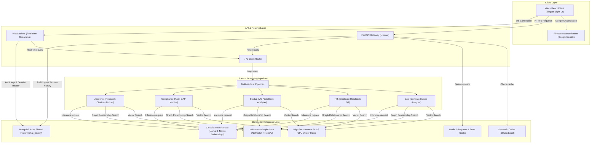

# DocsAI — Multi-Vertical Agentic RAG Platform

DocsAI is an enterprise-grade AI Document Q&A and Knowledge Graph Platform designed to analyze, index, search, and reason over unstructured documents across multiple business verticals. 

Built with a modern FastAPI backend, a custom high-performance in-process Graph Database, Cloudflare Workers AI model routing, and a polished React/Vite light-mode frontend, the system provides context-aware multi-step reasoning, semantic citations, and historical query auditing.

---

## 🏗️ System Architecture



---

## 🌟 Core Features

### 1. 🧠 Multi-Vertical Intent Routing
DocsAI supports multiple business domains natively, each configured with specific prompting agents, chunking rules, and retrieval strategy parameters:
*   **Academic Research:** Designed to read papers, track author names, build citation references, and map paper topics.
*   **Legal Contracts:** Analyzes agreements, identifies obligations, classifies liability clauses, and scans for red flags.
*   **Startup & VC:** Evaluates VC pitch decks, maps startup investment trends, and matches contributors.
*   **Compliance Audits:** Monitors regulation changes, performs compliance gap analysis, and traces regulatory obligations.
*   **HR Policies:** Accesses employee handbooks, reviews policies, and answers HR questions with cited rules.
*   *An intelligent **AI Intent Router** automatically classifies user queries and routes them to the correct vertical pipeline dynamically.*

### 2. ⚡ In-Process Graph Database & FAISS Vector Index
Replaces resource-heavy Neo4j clusters with a custom, thread-safe, memory-efficient in-process Graph Database:
*   **NetworkX Topology:** Maps document-to-chunk parent relationships, entity links, and keyword cross-references.
*   **FAISS Vector Acceleration:** Embeds text chunks via Nomic Atlas embeddings and performs high-speed vector retrieval using FAISS CPU indices (with optimized NumPy fallback).
*   **Thread Safety:** Powered by a re-entrant Reader-Writer Lock (`RWLock`) to allow concurrent reads and serialized background disk writes.

### 3. 🛡️ Firebase Google Identity Authentication
*   Fully integrated with Google Identity via **Firebase Authentication**.
*   Offers a seamless Google Accounts pop-up chooser for logins.
*   **Developer Mode Fallback:** Automatically switches to mock login mode if Firebase API credentials are not configured in the `.env` file on start, ensuring development stays friction-free.

### 4. 🗂️ Ingestion Vault & Auto-Classification
*   Upload documents to the **Document Vault**.
*   Two-phase classification agent automatically scans text previews and auto-detects the document vertical (Law, HR, Startup, etc.).
*   Documents are processed in the background using an asynchronous `asyncio` job queue.

### 5. 🔍 Auditing Logs & MongoDB History
*   Keeps session conversation logs and query execution parameters synced with MongoDB Atlas (stored in the constraint-free `chat_history` collection).
*   Tracks average retrieval latency, query response confidence scores, and unanswerable question analytics in the **History** and **Analytics** dashboards.

### 6. 🎨 Premium Light UI Theme
*   Stunning glassmorphism design system using HSL variables.
*   Subtle background grid mesh and micro-animations.
*   Interactive **Knowledge Graph Visualizer** viewport rendered on an engineering-grade dark coordinate grid with radial glows.

---

## 🛠️ Environment Setup

Create a `.env` file in the root directory by copying the template:

```powershell
Copy-Item .env.example .env
```

Define the configuration parameters:

```env
# Cloudflare Workers AI Credentials
CF_ACCOUNT_ID=your_cloudflare_account_id
CF_API_TOKEN=your_cloudflare_api_token
NOMIC_API_KEY=your_nomic_embedding_api_key

# Database Connections
MONGODB_URI=your_mongodb_atlas_connection_string
MONGODB_DB=job_agent
MONGODB_COLLECTION=chat_history

# Firebase Configuration (Sign-In with Google)
VITE_FIREBASE_API_KEY=your-firebase-api-key
VITE_FIREBASE_AUTH_DOMAIN=your-auth-domain.firebaseapp.com
VITE_FIREBASE_PROJECT_ID=your-project-id
VITE_FIREBASE_STORAGE_BUCKET=your-project-id.appspot.com
VITE_FIREBASE_MESSAGING_SENDER_ID=your-sender-id
VITE_FIREBASE_APP_ID=your-app-id

# Local Configuration
VITE_API_BASE_URL=http://localhost:8000/api/v1
VITE_WS_BASE_URL=ws://localhost:8000/api/v1
VITE_TENANT_ID=tenant-123
```

---

## 🚀 Running Locally

### Backend Server
Install Python dependencies and run the FastAPI server (uvicorn watches only `/app` to prevent file-lock reloading cycles):

```powershell
cd backend
python -m venv .venv
.\.venv\Scripts\Activate.ps1
pip install -r requirements.txt
python -m spacy download en_core_web_sm
python -m uvicorn main:app --host 127.0.0.1 --port 8000 --reload --reload-dir app
```

### Frontend Web Client
Run Vite dev server locally:

```powershell
cd frontend
npm install
npm run dev
```

*Access the application at `http://localhost:5173/`.*
